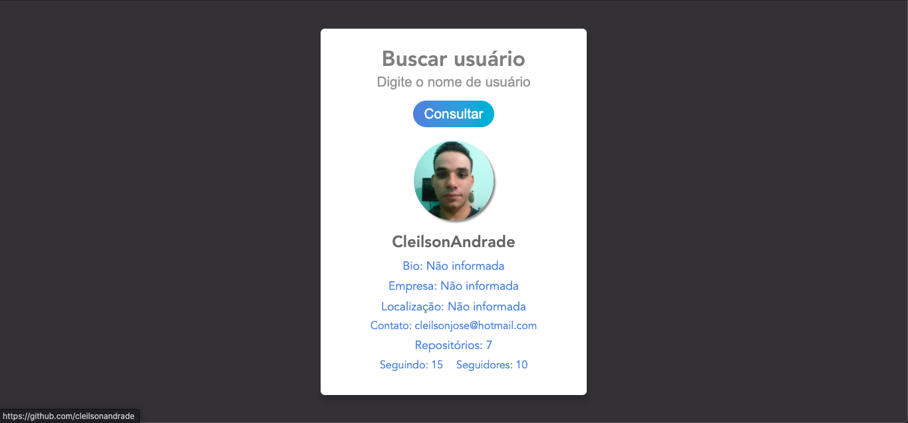

<div align="center">
  <h1>Busca Git</h1>
  <p>Aplicação para realizar busca de usuários no GitHub de forma simples.</p>
  
</div>

## Índice

* [Descrição](#descrição)
* [Features](#features) 
* [Tecnologias](#tecnologias)
* [Design](#design)
  * [Cores](#cores)
  * [Tipo de fonte](#fontes)
* [Instalação](#instalação)
* [Licença](#licença)

# 📃 Descrição
Aplicação desenvolvida utilizando a API do [**GitHub**](https://docs.github.com/pt/rest/guides/getting-started-with-the-rest-api), para realizar busca de usuários, utilizando a lib [**axios**](https://github.com/axios/axios) para requisições e respostas.

## Features
- [x] Requisição a API<br>
- [x] Responsividade<br>
- [x] Validação de dados<br>

# 💻 <span id="tecnologias">Tecnologias:</span>
- **HTML**
- **CSS**
- **JavaScript**
- **axios**

# 🎨 Design
- O modelo final para versão desktop e mobile está disponível na pasta `./design`

- <span id="cores">Cores<br></span>
 #323236<br>
 #dadce7<br>
 #969696<br>
 #4091dd<br>
 #28b4d2<br>

- <span id="fontes">Tipo de fonte<br></span>
 Avenir, Helvetica, Arial, sans-serif

# 🚀 <span id="instalação">Instalação</span>
```bash
  # Clone este repositório:
  $ git clone https://github.com/CleilsonAndrade/Busca_Git
  $ cd ./Busca_Git
```

# 📝 Licença

Esse projeto está sob a licença MIT. Veja o arquivo [LICENSE](LICENSE) para mais detalhes.

---

<p align="center">
  Feito com 💜 by CleilsonAndrade
</p>